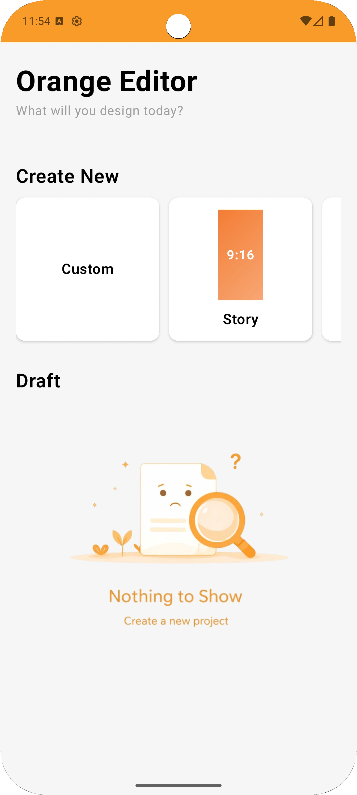
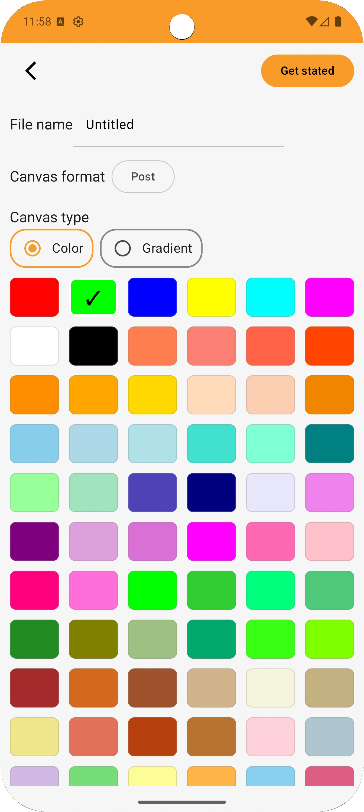
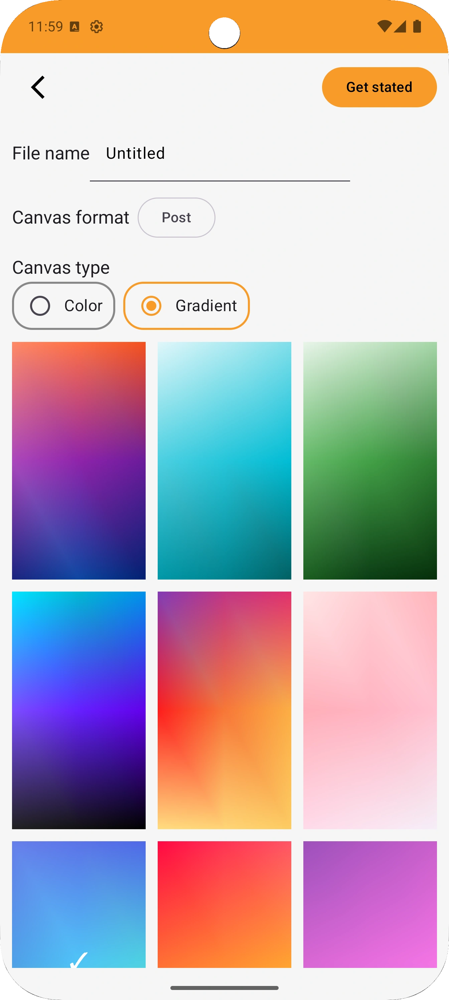
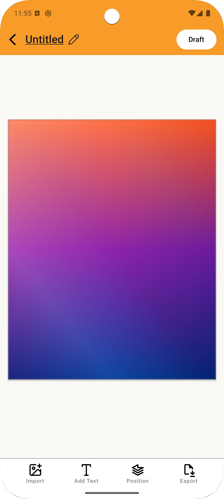
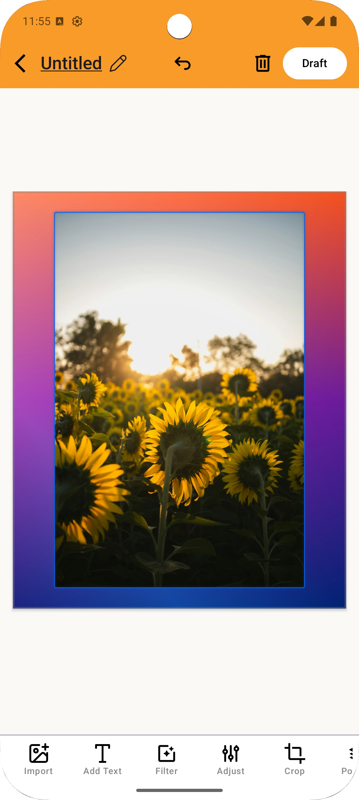
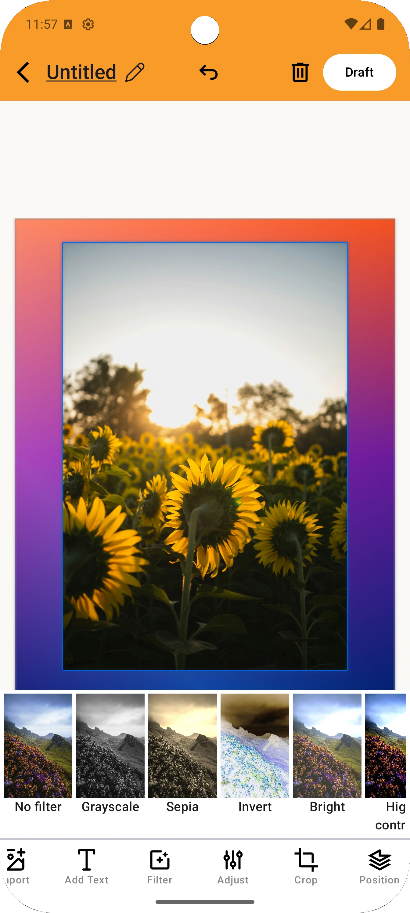
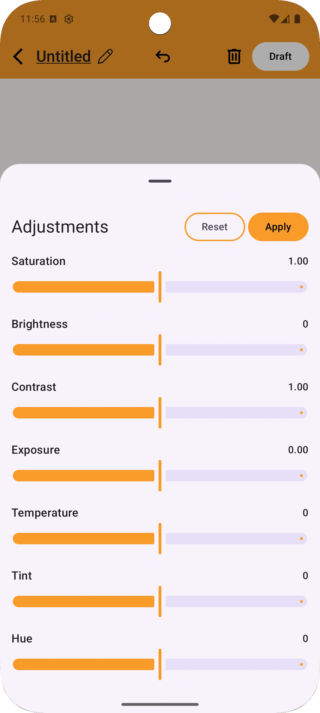
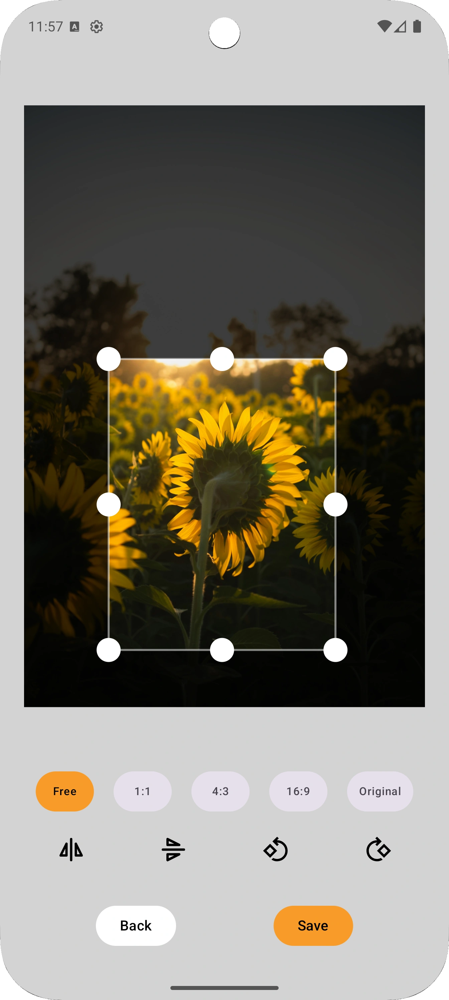
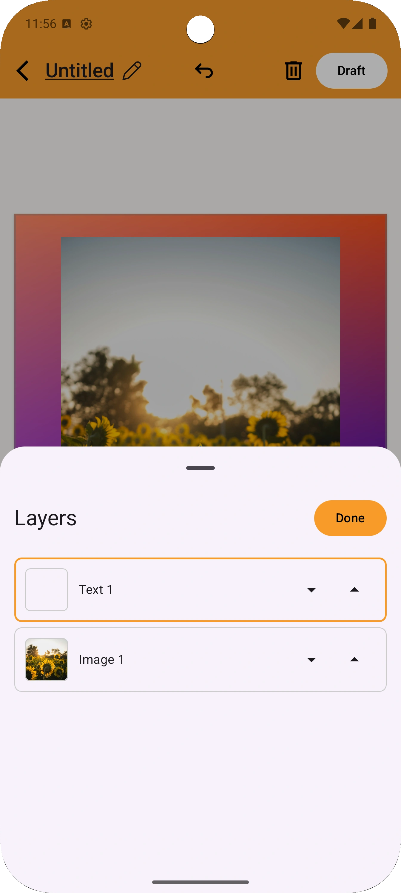

#  Orange Editor

Orange Editor is a lightweight, offline Android image editor designed for fast and intuitive image
manipulation without requiring an internet connection.

## 🚀 Features

- Supports multiple image formats
- Custom gradient backgrounds
- Flexible canvas sizes
- Layer-based editing system
- High-quality image export
- Support Filter ( Grayscale, Sepia, Invert, High Contrast etc.)
- Advanced image adjustments:
    - Saturation
    - Brightness
    - Contrast
    - Exposure
    - Temperature
    - Tint
    - Hue

## 🛠️ Tech Stack

* **Language:** Kotlin
* **UI:** Jetpack Compose
* **Architecture:** MVVM

## 📱 Screenshots

| Home                                                            | Custom Canvas (Color)                                           | Custom Canvas (Gradient)                                        |
|-----------------------------------------------------------------|-----------------------------------------------------------------|-----------------------------------------------------------------|
|  |  |  |

| Editor Screen                                                   | Editor Screen (With Image)                                      | Editor Screen (With Image + Filter)                             |
|-----------------------------------------------------------------|-----------------------------------------------------------------|-----------------------------------------------------------------|
|  |  |  |

| Adjustments                                                     | Crop                                                            | Export                                                          |
|-----------------------------------------------------------------|-----------------------------------------------------------------|-----------------------------------------------------------------|
|  |  |  |

## 🔧 Requirements

* JDK 21
* Android Studio (latest stable recommended)

## ⚙️ Installation

1. Clone the repository:

    ```bash
    git clone https://github.com/manishjajoriya/OrangeEditor.git
    ```

2. Open the project in **Android Studio**
3. Sync Gradle
4. Run the app 🚀

## 📂 Project Structure

```
com.manishjajoriya.orangeeditor
│── data          # Database, DTOs, mappers, repository implementations
│── di            # Dependency Injection (Hilt modules)
│── domain        # Model and repository interface
│── navgraph      # Navigation setup and routes
│── presentation  # UI (Jetpack Compose screens & components)
│── util          # Utility classes and extensions
```

## 🧠 Design Approach

* Follows clean architecture principles
* Separation of concerns across layers
* Reactive UI using Compose + state-driven ViewModels
* Scalable and maintainable codebase

## 🤝 Contributing

Contributions are welcome!  
Feel free to fork the repo and submit a pull request.

## 🙌 Acknowledgements

* Android Jetpack libraries - For Ui and other core android part
* [Coil](https://coil-kt.github.io/coil/) - For Image Loading
* [KvColorPicker](https://github.com/KvColorPalette/KvColorPicker-Android) - Color Picker
* [Crop Kit](https://github.com/Tanish-Ranjan/crop-kit) - Crop Image
